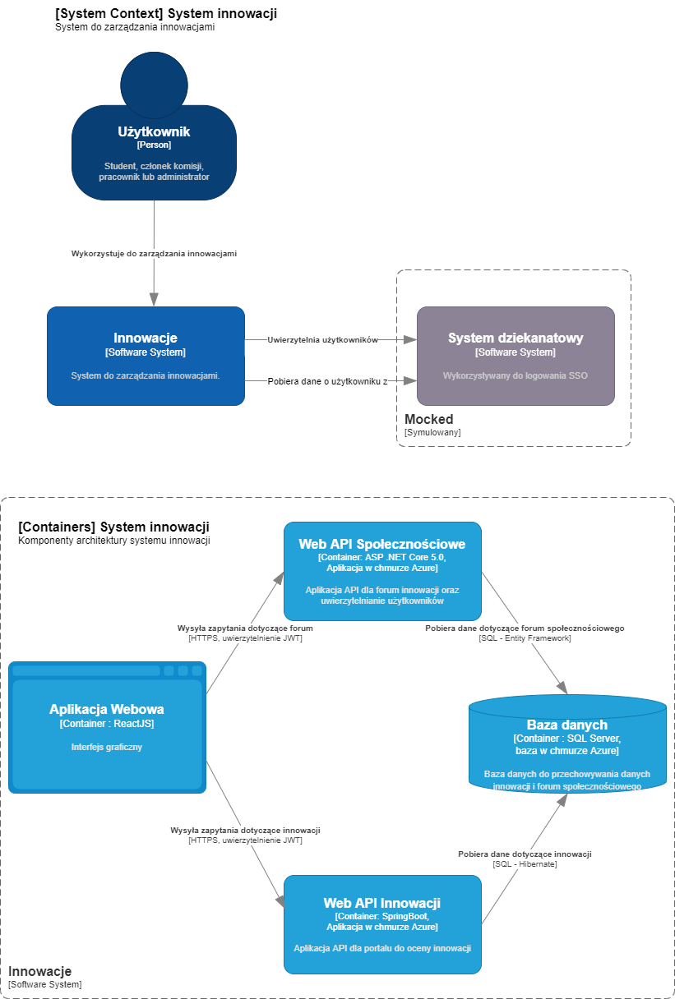

# APSI - Innowacje
Powyższa organizacja służy jako kontener repozytoriów kodu aplikacji tworzonej w ramach projektu z przedmiotu APSI. Temat projektu to zadanie nr. 5 z zestawu 2 o tytule ***Innowacje***. Celem zadania jest stworzenie	aplikacji umożliwiającej	studentom	i	pracownikom	uczelni	zgłaszanie	innowacyjnych	
pomysłów	dotyczących	funkcjonowania	uczelni	oraz	innych	związanych	z	życiem	akademickim.

## Architektura aplikacji

  

## Użyte technologie
| Moduł                                | Użyte technologie | 
| :-------------:                      |    :----:         |          
| Portal innowacji - backend           | `Java 11`, `Spring Boot 2.5.6`, `Gradle 7.2`      | 
| Portal społecznościowy - backend     | `ASP .NET Core 5.0`                               | 
| Aplikacja Webowa - frontend          | `ReactJS 17`, `Typescript 4`                           | 

## CI/CD
#### Backend
Do wdrażania kolejnych wersji, aplikacje backendowe używają [GitHub Actions](https://github.com/features/actions), dzięki czemu po każdym `pushu`, aplikacja jest budowana ze podanej gałęzi oraz wdrażana na platformę [Microsoft Azure](https://azure.microsoft.com/pl-pl/).
#### Frontend
TODO

## Adresy 
#### Backend innowacji
* [Portal społecznościowy](https://apsi-backend-dotnet.azurewebsites.net/swagger/index.html) (.NET backend)
* [Repozytorium kodu](https://github.com/apsi-innovatons/apsi-backend-dotnet)
#### Backend forum społecznościowego
* [Portal innowacji](https://apsi-backend-java.azurewebsites.net/swagger-ui.html) (Spring Boot backend)
* [Repozytorium kodu](https://github.com/apsi-innovatons/apsi-backend-java)
#### Frontend 
* [Repozytorium kodu](https://github.com/radziminski/apsi-innowacje-frontend/tree/dev)
* [Aplikacja](https://apsi-innowacje-dev.vercel.app/login)
#### Projekt bazy danych i aplikacja generująca testowe dane
* [Repozytorium kodu]https://github.com/apsi-innovatons/apsi-database
#### Planowanie pracy
* [Agile board](https://linear.app/innowacje/team/INN/board)
